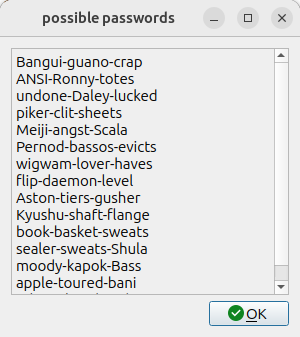

# password-generator
A script for generating new style passwords consisting of words and hyphens

Two bash scripts

**random_passwords.sh**

Takes a numeric argument and prints a candidate password.

This has a dependency on there being a dictionary of words so

`sudo apt install wbritish`

or 

`sudo apt install wamerican`

etc.

**password_dialog.sh**

Sends the results of several calls of the previous script to a gui dialog

Dependency on kdialog

`sudo apt install kdialog`

It assumes that random_passwords.sh is in the users's  ~/bin folder 

`/home/${USER}/bin/random_passwords.sh` 

Both scripts need to be marked executable

`chmod a+x random_passwords.sh`

